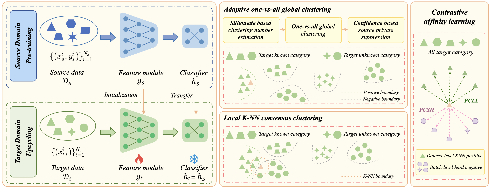

# [GLC++: Source-Free Universal Domain Adaptation through Global-Local Clustering and Contrastive Affinity Learning](https://arxiv.org/abs/2403.14410)


## Introduction
This repository contains the code for the paper <a href="https://arxiv.org/abs/2403.14410">GLC++ </a>, which is an substantial extension of our CVPR 2023 paper <a href="https://arxiv.org/abs/2303.07110">GLC</a>. Despite the simple global and local clustering (GLC) technique achieving commendable performance in separating "known" and "unknown" data, its reliance on pseudo-labeling supervision, especially using uniform encoding for all "unknown" data limits its capacity to discriminate among different "unknown" categories. To alleviate this, we promote GLC to GLC++ by developing a new contrastive affinity learning strategy, sidestepping the need for a specialized source model structure. Remarkably, in the most challenging open-partial-set scenarios on VisDA, GLC++ boosts up the H-score from 73.1% to 75.0%. GLC++ enhances the novel category clustering accuracy of GLC by 4.3% in open-set scenarios on Office-Home. Furthermore, the introduced contrastive learning strategy not only enhances GLC but also significantly facilitates existing methodologies.


## Framework



## Prerequisites
- python3, pytorch, numpy, PIL, scipy, sklearn, tqdm, etc.
- We have presented the our conda environment file in `./environment.yml`.

## Dataset
We have conducted extensive expeirments on four datasets with three category shift scenario, i.e., Partial-set DA (PDA), Open-set DA (OSDA), and Open-partial DA (OPDA). The following is the details of class split for each scenario. Here, $\mathcal{Y}$, $\mathcal{\bar{Y}_s}$, and $\mathcal{\bar{Y}_t}$ denotes the source-target-shared class, the source-private class, and the target-private class, respectively. 

| Datasets    | Class Split| | $\mathcal{Y}/\mathcal{\bar{Y}_s}/\mathcal{\bar{Y}_t}$| |
| ----------- | --------   | -------- | -------- | -------- |
|             | OPDA       | OSDA     | PDA      |  CLDA    |
| Office-31   | 10/10/11   | 10/0/11  | 10/21/0  |  31/0/0  | 
| Office-Home | 10/5/50    | 25/0/40  | 25/40/0  | 65/0/0   |
| VisDA-C     | 6/3/3      | 6/0/6    | 6/6/0    |    -     |
| DomainNet   | 150/50/145 |    -     |   -      |    -     |

Please manually download these datasets from the official websites, and unzip them to the `./data` folder. To ease your implementation, we have provide the `image_unida_list.txt` for each dataset subdomains. 

```
./data
├── Office
│   ├── Amazon
|       ├── ...
│       ├── image_unida_list.txt
│   ├── Dslr
|       ├── ...
│       ├── image_unida_list.txt
│   ├── Webcam
|       ├── ...
│       ├── image_unida_list.txt
├── OfficeHome
│   ├── ...
├── VisDA
│   ├── ...
```

## Training
1. Open-partial Domain Adaptation (OPDA) on Office, OfficeHome, and VisDA
```
# Source Model Preparing
bash ./scripts/train_source_OPDA.sh
# Target Model Adaptation
bash ./scripts/train_target_OPDA.sh
```
2. Open-set Domain Adaptation (OSDA) on Office, OfficeHome, and VisDA
```
# Source Model Preparing
bash ./scripts/train_source_OSDA.sh
# Target Model Adaptation
bash ./scripts/train_target_OSDA.sh
```
3. Partial-set Domain Adaptation (PDA) on Office, OfficeHome, and VisDA
```
# Source Model Preparing
bash ./scripts/train_source_PDA.sh
# Target Model Adaptation
bash ./scripts/train_target_PDA.sh
```

<!-- ## Results
NOTE THAT GLC ONLY RELIES ON STANDARD CLOSED-SET MODEL!

| OPDA    |Source-free         | Veneue| Office-31| OfficeHome | VisDA| DomainNet |
| ------- | --------  | ----- |-------- | --------   | ---- | ---- | 
|DANCE | No | NeurIPS-21 |80.3 | 63.9 | 42.8| 33.5|
|OVANet| No | ICCV-21    |86.5 | 71.8 | 53.1| 50.7|
|GATE  | No | CVPR-22    |87.6 | 75.6 | 56.4| 52.1|
|UMAD  | Yes | Arxiv-21      |87.0 | 70.1 | 58.3| 47.1|
|GLC   | Yes | CVPR-23    |**87.8** | **75.6** | **73.1**| **55.1**|

| OSDA    |Source-free         | Veneue| Office-31| OfficeHome | VisDA|
| ------- | --------  | ----- |-------- | --------   | ---- |
|DANCE | No | NeurIPS-21 |79.8 | 12.9 | 67.5|
|OVANet| No | ICCV-21    |**91.7** | 64.0 | 66.1|
|GATE  | No | CVPR-22    |89.5 | 69.0 | 70.8|
|UMAD  | Yes | Arxiv-21     |89.8 | 66.4 | 66.8|
|GLC   | Yes | CVPR-23    |89.0 | **69.8** | **72.5**|

| PDA    |Source-free         | Veneue| Office-31| OfficeHome | VisDA|
| -------| --------  | ----- |-------- | --------   | ---- |
|DANCE | No | NeurIPS-21 |79.8 | 12.9 | 67.5|
|OVANet| No | ICCV-21    |91.7 | 64.0 | 66.1|
|GATE  | No  | CVPR-22    |93.7 | **74.0** | 75.6|
|UMAD  | Yes | Arxiv-21   |89.5 | 66.3 | 68.5|
|GLC   | Yes | CVPR-23    |**94.1** | 72.5 | **76.2**| -->

## Citation
If you find our codebase helpful, please star our project and cite our paper:
```
@article{sanqing2024GLC_PLUS,
  title={GLC++: Source-Free Universal Domain Adaptation through Global-Local Clustering and Contrastive Affinity Learning},
  author={Qu, Sanqing and Zou, Tianpei and Röhrbein, Florian and Lu, Cewu and Chen, Guang and Tao, Dacheng and Jiang, Changjun},
  journal={arXiv preprint arXiv:2403.14410},
  year={2024}
}

@inproceedings{sanqing2023GLC,
  title={Upcycling Models under Domain and Category Shift},
  author={Qu, Sanqing and Zou, Tianpei and Röhrbein, Florian and Lu, Cewu and Chen, Guang and Tao, Dacheng and Jiang, Changjun},
  booktitle={CVPR},
  year={2023},
}
```

## Contact
- sanqingqu@gmail.com or 2011444@tongji.edu.cn
